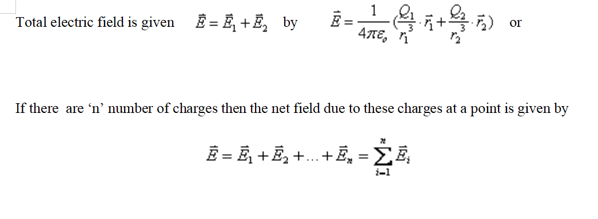
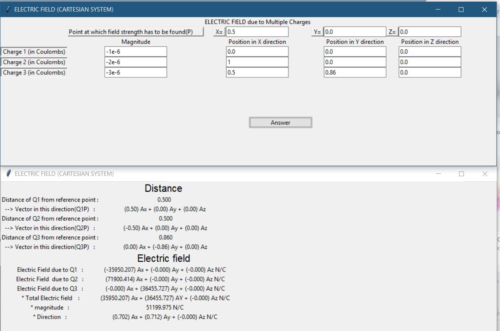

# ElectricField Calculator

Python Gui Project to Calculate Electric Field between 3 charges using Tkinter

# Formula

Using [Coulomb's Law](https://en.wikipedia.org/wiki/Coulomb%27s_law)

# Gui

# License

MIT

